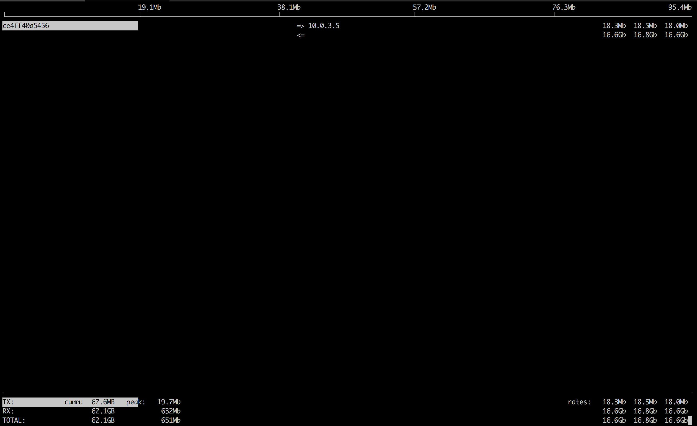
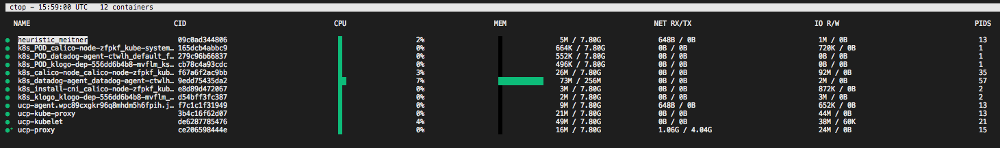

# SecureShoot
# Docker + Kubernetes swiss tool

```
  #####                                      #####                             
 #     # ######  ####  #    # #####  ###### #     # #    #  ####   ####  ##### 
 #       #      #    # #    # #    # #      #       #    # #    # #    #   #   
  #####  #####  #      #    # #    # #####   #####  ###### #    # #    #   #   
       # #      #      #    # #####  #            # #    # #    # #    #   #   
 #     # #      #    # #    # #   #  #      #     # #    # #    # #    #   #   
  #####  ######  ####   ####  #    # ######  #####  #    #  ####   ####    #  
```


- **Purpose:** Docker and Kubernetes network troubleshooting can become complex. With proper understanding of how Docker and Kubernetes networking works and the right set of tools, you can troubleshoot and resolve these networking issues. The `secureshoot` container has a set of powerful networking tshooting tools that can be used to troubleshoot Docker networking issues. Along with these tools come a set of use-cases that show how this container can be used in real-world scenarios.

**Network Namespaces:** Before starting to use this tool, it's important to go over one key topic: **Network Namespaces**. Network namespaces provide isolation of the system resources associated with networking. Docker uses network and other type of namespaces (`pid`,`mount`,`user`..etc) to create an isolated environment for each container. Everything from interfaces, routes, and IPs is completely isolated within the network namespace of the container. 

Kubernetes also uses network namespaces. Kubelets creates a network namespace per pod where all containers in that pod share that same network namespace (eths,IP, tcp sockets...etc). This is a key difference between Docker containers and Kubernetes pods.

Cool thing about namespaces is that you can switch between them. You can enter a different container's network namespace, perform some troubleshooting on its network's stack with tools that aren't even installed on that container. Additionally, `secureshoot` can be used to troubleshoot the host itself by using the host's network namespace. This allows you to perform any troubleshooting without installing any new packages directly on the host or your application's package. 

## SecureShoot with Docker

* **Container's Network Namespace:** If you're having networking issues with your application's container, you can launch `secureshoot` with that container's network namespace like this:
  
    `$ docker run --rm -it --tty --net container:<container_name> ghcr.io/lordoverlord/secureshoot:main`

* **Host's Network Namespace:** If you think the networking issue is on the host itself, you can launch `secureshoot` with that host's network namespace:
  
    `$ docker run --rm -it --tty --net host ghcr.io/lordoverlord/secureshoot:main`

* **Network's Network Namespace:** If you want to troubleshoot a Docker network, you can enter the network's namespace using `nsenter`. This is explained in the `nsenter` section below.

* **Vanilla Docker usage:** If you wanna use it in docker desktop

    `$ docker run --rm -it --tty  --volume /var/run/docker.sock:/var/run/docker.sock:ro -it ghcr.io/lordoverlord/secureshoot:main`

## SecureShoot with Docker Compose

You can easily deploy `secureshoot` using Docker Compose using something like this:

```
version: "3.6"
services:
  tcpdump:
    image: ghcr.io/lordoverlord/secureshoot
    depends_on:
      - nginx
    command: tcpdump -i eth0 -w /data/nginx.pcap
    network_mode: service:nginx
    volumes:
      - $PWD/data:/data

  nginx:
    image: nginx:alpine
    ports:
      - 80:80
```

## SecureShoot with Kubernetes

* If you want to spin up a throw away container for debugging.
  
    `$ kubectl run secureshoot --rm -it --tty --image ghcr.io/lordoverlord/secureshoot:main`

* if you want to spin up a container on the host's network namespace.
  
    `$ kubectl run secureshoot --rm -it --tty --overrides='{"spec": {"hostNetwork": true}}'  --image ghcr.io/lordoverlord/secureshoot:main`

* if you want to use secureshoot as a sidecar container to troubleshoot your application container
  
  ```
    $ cat secureshoot-sidecar.yaml
    apiVersion: apps/v1
    kind: Deployment
    metadata:
        name: ngisecureshootoot
        labels:
            app: secureshoottshoot
    spec:
    replicas: 1
    selector:
        matchLabels:
            apsecureshoot-netshoot
    template:
        metadata:
        labels:
           secureshootinx-netshoot
        spec:
            containers:
            - name: nginx
            image: nginx:1.14.2
            ports:
                - containerPort: 80
     secureshoot name: netshoot
          secureshoot lordoverlord/netshoot
            command: ["/bin/bash"]
            args: ["-c", "while true; do ping localhost; sleep 60;done"]
  
  secureshootctl apply -f netshoot-sidecar.yaml
    secureshootment.apps/nginx-secureshoot created
  
    $ kubectl get pod
  NAME                              READY   STATsecureshootSTARTS   AGE
  nginx-netshoot-7f9c6957f8-kr8q6   2/2     Running   0          4m27
  
  $kubectl exec -it ngsecureshoothoot-7f9c6957f8-kr8q6 -c netshoot -- /bin/bash

    nginx-secureshoot-7f9c6957f8-kr8q6 $ 

'''

**Network Problems** 

Many network issues could result in application performance degradation. Some of those issues could be related to the underlying networking infrastructure(underlay). Others could be related to misconfiguration at the host or Docker level. Let's take a look at common networking issues:

* latency
* routing 
* DNS resolution
* firewall 
* incomplete ARPs

To troubleshoot these issues, `secureshoot` includes a set of powerful tools as recommended by this diagram. 


**Included Packages:** The following packages are included isecureshootoot`. We'll go over some with some sample use-cases.

```
bash
   busybox-extras
   curl
   drill
   file
   iftop
   iperf3
   jq
   mtr
   openjdk11
   openssl
   tcptraceroute
   git
   htop
   kafka
   confluent
```

## **Sample Use-cases** 

## iperf3

Purpose: test networking performance between two containers/hosts. 

Create Overlay network:

```

$ docker network create -d overlay perf-test

```

Launch two containers:

```

🐳  → docker service create --name perf-test-a --network perf-test lordoverlord/secureshoot iperf3 -s -p 9999
7dkcckjs0g7b4eddv8e5ez9nv

🐳  → docker service create --name perf-test-b --network perf-test lordoverlord/secureshoot iperf3 -c perf-test-a -p 9999
2yb6fxls5ezfnav2z93lua8xl

 🐳  → docker service ls
ID            NAME         REPLICAS  IMAGE              COMMAND
2yb6fxls5ezf  perf-test-b  1/1       lordoverlord/secureshoot  iperf3 -c perf-test-a -p 9999
7dkcckjs0g7b  perf-test-a  1/1       nicolasecureshootoot  iperf3 -s -p 9999

🐳  → docker ps
CONTAINER ID        IMAGE                      COMMAND                  CREATED             STATUS              PORTS               NAMES
ce4ff40a5456        lordoverlord/secureshoot:latest   "iperf3 -s -p 9999"       31 seconds ago      Up 30 seconds                        iperf3 -test- .1.bil2mo8inj3r9nyrss1g15qav

🐳  → docker logs ce4ff40a5456
------------------------------------------------------------

Server listening on TCP port 9999
TCP window size: 85.3 KByte (default)

------------------------------------------------------------

[  4] local 10.0.3.3 port 9999 connected with 10.0.3.5 port 35102
[ ID] Interval       Transfer     Bandwidth
[  4]  0.0-10.0 sec  32.7 GBytes  28.1 Gbits/sec
[  5] local 10.0.3.3 port 9999 connected with 10.0.3.5 port 35112
```


## iftop

Purpose: iftop does for network usage what top does for CPU usage. It listens to network traffic on a named interface and displays a table of current bandwidth usage by pairs of hosts.

Continuing the `iperf3` example.
```

 → docker ps
CONTAINER ID        IMAGE                      COMMAND                  CREATED             STATUS              PORTS               NAMES
ce4ff40a5456        lordoverlord/secureshoot:latest   "iperf3 -s -p 9999"       5 minutes ago       Up 5 minutes                            perf-test-a.1.bil2mo8inj3r9nyrss1g15qav

🐳  → docker run -it --net container:perf-test-a.1.bil2mo8inj3r9nyrss1g15qav lordoverlord/secureshoot iftop -i eth0

```


## drill

Purpose: drill is a tool    to designed to get all sorts of information out of the DNS.

Continuing the `iperf` example, we'll use `drill` to understand how services' DNS is resolved in Docker. 
```

🐳  → docker run -it --net container:perf-test-a.1.bil2mo8inj3r9nyrss1g15qav lordoverlord/secureshoot drill -V 5 perf-test-b
;; ->>HEADER<<- opcode: QUERY, rcode: NOERROR, id: 0
;; flags: rd ; QUERY: 1, ANSWER: 0, AUTHORITY: 0, ADDITIONAL: 0
;; QUESTION SECTION:
;; perf-test-b.    IN    A

;; ANSWER SECTION:

;; AUTHORITY SECTION:

;; ADDITIONAL SECTION:

;; Query time: 0 msec
;; WHEN: Thu Aug 18 02:08:47 2016
;; MSG SIZE  rcvd: 0
;; ->>HEADER<<- opcode: QUERY, rcode: NOERROR, id: 52723
;; flags: qr rd ra ; QUERY: 1, ANSWER: 1, AUTHORITY: 0, ADDITIONAL: 0
;; QUESTION SECTION:
;; perf-test-b.    IN    A

;; ANSWER SECTION:
perf-test-b.    600    IN    A    10.0.3.4 <<<<<<<<<<<<<<<<<<<<<<<<<< Service VIP

;; AUTHORITY SECTION:

;; ADDITIONAL SECTION:

;; Query time: 1 msec
;; SERVER: 127.0.0.11 <<<<<<<<<<<<<<<<<<<<<<<<<<<<<<<<<<<<< Local resolver 
;; WHEN: Thu Aug 18 02:08:47 2016
;; MSG SIZE  rcvd: 56

```

## ctop

`ctop` is a free open source, simple and cross-platform top-like command-line tool for monitoring container metrics in real-time. It allows you to get an overview of metrics concerning CPU, memory, network, I/O for multiple containers and also supports inspection of a specific container.

To get data into ctop, you'll need to bind docker.sock into the secureshoot container.

	`/ # `docker run -it --rm -v /var/run/docker.sock:/var/run/docker.sock lordoverlord/secureshoot ctop``



It will display running and existed containers with useful metrics to help troubleshoot resource issues; hit "q" to exit.

## Contribution

Feel free to provide to contribute troubleshooting tools and use-cases by opening PRs. If you would like to add any package, please follow these steps:

* In the PR, please include some rationale as to why this tool is useful to be included in secureshoot. 
  
  > Note: If the functionality of the tool is already addressed by an existing tool, I might not accept the PR
* Change the Dockerfile to include the new package/tool
* If you're building the tool from source, make sure you leverage the multi-stage build process and update the `build/fetch_binaries.sh` script 
* Update the README's list of included packages AND include a section on how to use the tool
* If the tool you're adding supports multi-platform, please make sure you highlight that.
